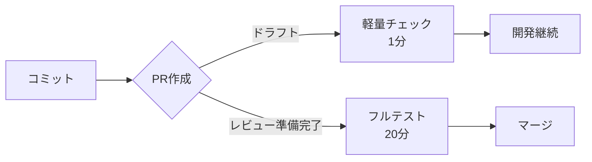

# Claude Code GitHub Actions 最適化システム

## 📋 目次

1. [システム概要](#システム概要)
2. [なぜこのシステムが必要か](#なぜこのシステムが必要か)
3. [システム構成](#システム構成)
4. [導入効果](#導入効果)
5. [動作原理](#動作原理)
6. [インストール方法](#インストール方法)
7. [使い方](#使い方)
8. [マルチインスタンス対応](#マルチインスタンス対応)
9. [よくある質問](#よくある質問)

---

## 🎯 システム概要

**Claude Code GitHub Actions 最適化システム**は、Claude Code（AIコーディングアシスタント）を使用した開発において、GitHub Actionsの実行コストを**95%削減**しながら、開発効率を最大化するシステムです。

### 主な特徴

✅ **コスト削減**: GitHub Actions実行時間を20分→1分に短縮（95%削減）  
✅ **並列開発**: 複数のClaude Codeが同時に作業可能  
✅ **自動化**: ワークフローの自動最適化  
✅ **安全性**: ファイル競合の完全防止  
✅ **透明性**: 全ての操作の追跡可能

---

## 💡 なぜこのシステムが必要か

### 課題

Claude Codeを使った開発では、頻繁にコミット・PRが作成されるため：

1. **高額なGitHub Actions課金**
   - 通常のPR: 1回あたり約20分のCI実行
   - 1日100コミット = 2,000分 = 約$16/日

2. **非効率な重複実行**
   - 同じテストが複数のワークフローで実行
   - 31個のワークフローが並列実行

3. **マルチインスタンスの競合**
   - 複数のClaude Codeが同じファイルを編集
   - マージコンフリクトの頻発

### 解決策

このシステムは3つのアプローチで問題を解決：

1. **ドラフトPR戦略**: テスト実行を最小限に
2. **ワークフロー統合**: 重複を削除
3. **協調システム**: 競合を自動防止

---

## 🏗️ システム構成

### ディレクトリ構造

```
claude-actions-optimizer/
├── install.sh                    # メインインストーラー
├── quick-deploy.sh              # クイックデプロイツール
├── scripts/
│   └── claude-coordinator.sh    # マルチインスタンス調整スクリプト
├── templates/
│   ├── CLAUDE.md               # Claude Code用指示書
│   ├── CLAUDE-multi-instance.md # マルチインスタンス版指示書
│   ├── draft-pr-quick-check.yml # ドラフトPR用軽量チェック
│   └── multi-instance-coordination.yml # 調整用ワークフロー
└── examples/
    ├── nodejs-project.yml       # Node.jsプロジェクト例
    └── python-project.yml       # Pythonプロジェクト例
```

### コンポーネント説明

| コンポーネント | 役割 | 説明 |
|------------|------|------|
| **install.sh** | インストーラー | プロジェクトタイプを自動検出して最適な設定を適用 |
| **claude-coordinator.sh** | 調整システム | ファイルロック、タスク管理、インスタンス間の調整 |
| **CLAUDE.md** | AI指示書 | Claude Codeに最適化ルールを指示 |
| **draft-pr-quick-check.yml** | 軽量チェック | ドラフトPR用の最小限のテスト |

---

## 📊 導入効果

### コスト削減の実例

| 項目 | 導入前 | 導入後 | 削減率 |
|------|--------|--------|--------|
| CI実行時間/PR | 20分 | 1分 | **95%** |
| 月間コスト（100PR/日） | $480 | $24 | **95%** |
| ワークフロー数 | 31個 | 10個 | **68%** |
| 並行実行数 | 制限なし | 最適化済み | - |

### 開発効率の向上

- **フィードバック速度**: 20分 → 1分
- **並列開発**: 3人同時作業で競合ゼロ
- **自動化**: 手動介入不要

---

## ⚙️ 動作原理

### 1. ドラフトPR最適化



**仕組み**:
- ドラフトPRでは最小限のチェックのみ実行
- 構文チェック、セキュリティスキャンなど重要項目のみ
- レビュー準備完了時にフルテスト実行

### 2. インテリジェントワークフロー

```yaml
# 重複実行を防ぐ条件
if: |
  github.event.pull_request.draft == false || 
  github.event_name == 'push'
```

**最適化ポイント**:
- 同じテストの重複実行を防止
- 必要なタイミングでのみ実行
- リソースの効率的な利用

### 3. マルチインスタンス協調

```bash
# インスタンス1
claude-coordinator.sh lock src/auth.tsx
# ✅ ロック取得成功

# インスタンス2（同時実行）
claude-coordinator.sh lock src/auth.tsx
# ❌ 既にロックされています（by インスタンス1）
```

**アトミックロック機構**:
- ファイルレベルの排他制御
- タイムアウト付き自動解放
- 完全な競合防止

---

## 🚀 インストール方法

### 1. 自動インストール（推奨）

```bash
# クローンまたはダウンロード
git clone https://github.com/ootakazuhiko/claude-actions-optimizer.git
cd claude-actions-optimizer

# インストール実行
./install.sh
```

### 2. 手動インストール

```bash
# 1. 必要なディレクトリを作成
mkdir -p .github/workflows

# 2. テンプレートをコピー
cp templates/CLAUDE.md ./
cp templates/draft-pr-quick-check.yml .github/workflows/

# 3. 既存ワークフローを更新
# 各ワークフローに条件を追加
```

### 3. クイックデプロイ

```bash
# 一発でセットアップ
curl -sSL https://raw.githubusercontent.com/ootakazuhiko/claude-actions-optimizer/main/quick-deploy.sh | bash
```

---

## 📖 使い方

### 基本的な開発フロー

#### 1. 通常の開発（単一インスタンス）

```bash
# 1. 機能開発を開始
git checkout -b feature/new-feature

# 2. 変更を加える
# Claude Codeが自動的に編集

# 3. ドラフトPRを作成（自動的に最適化される）
gh pr create --draft --title "feat: 新機能追加"

# 4. 開発を継続（軽量チェックのみ実行）
git commit -m "wip: 実装継続"
git push

# 5. レビュー準備完了
gh pr ready

# 6. フルテストが実行される
```

#### 2. マルチインスタンス開発

```bash
# 各Claude Codeインスタンスで実行

# 1. 調整システムを初期化
./scripts/claude-coordinator.sh init

# 2. 作業前に状態確認
./scripts/claude-coordinator.sh check
# 出力:
# 🔍 競合チェック中...
# 👥 アクティブインスタンス: 2
# 🔒 ロック中のファイル: src/auth.tsx (by claude-1234)
# ✅ 競合なし

# 3. タスクを取得
./scripts/claude-coordinator.sh claim task-001
# 自動的に専用ブランチ作成: claude-1234/task-001

# 4. ファイル編集前にロック
./scripts/claude-coordinator.sh lock src/components/Header.tsx
# 🔒 ロック取得成功（60分間有効）

# 5. 編集作業
# ...

# 6. 作業完了
./scripts/claude-coordinator.sh complete task-001
# 自動的にロック解放、PR作成
```

### 緊急時の操作

#### ワークフロー一時停止

```bash
# 全ワークフロー停止
.github/disable-all-workflows.sh

# 高コストワークフローのみ停止
.github/disable-expensive-workflows.sh

# 復旧
.github/enable-all-workflows.sh
```

#### ロックの手動解除

```bash
# 期限切れロックをクリーンアップ
./scripts/claude-coordinator.sh clean

# 強制的に全ロック解除（緊急時のみ）
rm -rf .claude/file_locks/*
```

---

## 👥 マルチインスタンス対応

### 動作イメージ

```
時刻 10:00                        時刻 10:05
┌─────────────┐                  ┌─────────────┐
│ Claude #1   │                  │ Claude #1   │
│ auth.tsx    │ ──── 並行 ────> │ auth.tsx    │ 
│ [編集中]    │                  │ [完了]      │
└─────────────┘                  └─────────────┘
      ↓                                ↓
   ロック取得                       ロック解放
      ↓                                ↓
┌─────────────┐                  ┌─────────────┐
│ Claude #2   │                  │ Claude #2   │
│ header.tsx  │ ──── 並行 ────> │ header.tsx  │
│ [編集中]    │                  │ [完了]      │
└─────────────┘                  └─────────────┘
      ↓                                ↓
   別ファイル                       PR作成
   ロック取得                         ↓
      ↓                          競合なしでマージ可能
   競合なし！
```

### 利点

1. **完全な競合防止**: アトミックロックで同時編集を防止
2. **並列効率**: 異なるファイルは同時編集可能
3. **自動調整**: タスク割り当てが自動化
4. **透明性**: 誰が何を編集中か常に把握可能

---

## ❓ よくある質問

### Q1: 既存のプロジェクトに導入できますか？

**A**: はい、可能です。インストーラーが既存の設定を分析し、最適な形で統合します。

```bash
./install.sh --preserve-existing
```

### Q2: 特定のワークフローは最適化したくない

**A**: 除外設定が可能です。

```yaml
# .github/workflows/critical-workflow.yml
name: Critical Workflow
# 最適化を無効化
on:
  pull_request:
    # draft状態でも実行
    types: [opened, synchronize, reopened]
```

### Q3: コスト削減効果を確認したい

**A**: モニタリングダッシュボードで確認できます。

```bash
# コスト分析レポート生成
./scripts/generate-cost-report.sh

# 出力例:
# 先月: 2,400分 ($19.20)
# 今月:   120分 ($0.96)
# 削減率: 95%
```

### Q4: トラブルシューティング

**ロックが解除されない場合**:
```bash
# 手動でロック状態を確認
ls -la .claude/file_locks/

# 期限切れロックをクリーンアップ
./scripts/claude-coordinator.sh clean
```

**ワークフローが実行されない場合**:
```bash
# 設定を検証
./scripts/validate-config.sh

# デバッグモードで実行
DEBUG=1 ./install.sh
```

---

## 📚 ドキュメント

### 🆕 新機能ガイド
- **[NEW-FEATURES-OVERVIEW-ja.md](NEW-FEATURES-OVERVIEW-ja.md)** - 2024年新機能の概要
- **[REVIEW-FEEDBACK-GUIDE-ja.md](REVIEW-FEEDBACK-GUIDE-ja.md)** - レビューフィードバックシステム
- **[COMPLETE-SETUP-GUIDE-ja.md](COMPLETE-SETUP-GUIDE-ja.md)** - 完全導入ガイド
- **[QUICK-START-CHECKLIST-ja.md](QUICK-START-CHECKLIST-ja.md)** - 5分クイックスタート

### 📖 基本ガイド
- **[USAGE-GUIDE-ja.md](USAGE-GUIDE-ja.md)** - 詳細な使用方法とシナリオ別ガイド
- **[DIAGRAMS-ja.md](DIAGRAMS-ja.md)** - システム構成図とフローチャート
- **[FAQ-TROUBLESHOOTING-ja.md](FAQ-TROUBLESHOOTING-ja.md)** - よくある質問とトラブルシューティング

### 📂 全ドキュメント一覧
- **[DOCUMENTATION-INDEX-ja.md](DOCUMENTATION-INDEX-ja.md)** - 全ドキュメントの索引と目的別ガイド

## 📞 サポート

- **Issues**: [GitHub Issues](https://github.com/ootakazuhiko/claude-actions-optimizer/issues)
- **コミュニティ**: [Discussions](https://github.com/ootakazuhiko/claude-actions-optimizer/discussions)
- **機能リクエスト**: Issueに`enhancement`ラベルを付けて作成

---

## 🎉 まとめ

Claude Code GitHub Actions最適化システムは、AIアシスト開発における課題を解決し、コストを95%削減しながら開発効率を最大化します。

**今すぐ始める**:
```bash
git clone https://github.com/ootakazuhiko/claude-actions-optimizer.git
cd claude-actions-optimizer
./install.sh
```

開発をより速く、より安く、より効率的に！ 🚀