# Claude Actions Optimizer - Repository Management Strategy

## 🎯 推奨構成

### 独立リポジトリ + 多重配布戦略

```
claude-actions-optimizer/          # メインリポジトリ
├── README.md                     # メイン説明
├── install.sh                    # 汎用インストーラー
├── quick-deploy.sh               # 高速デプロイ
├── package.json                  # NPM配布用
├── action.yml                    # GitHub Actions用
├── templates/                    # プロジェクトテンプレート
│   ├── nodejs/
│   ├── python/
│   └── generic/
├── docs/                        # 詳細ドキュメント
├── examples/                    # 使用例
└── scripts/                    # 管理用スクリプト
```

## 📦 配布方法

### 1. curl/wget直接実行（最も簡単）
```bash
curl -sSL https://raw.githubusercontent.com/your-org/claude-actions-optimizer/main/install.sh | bash
```

### 2. Git clone（カスタマイズ向け）
```bash
git clone https://github.com/your-org/claude-actions-optimizer.git
cd claude-actions-optimizer
./install.sh
```

### 3. GitHub Releases（バージョン管理）
```bash
curl -sSL https://github.com/your-org/claude-actions-optimizer/releases/latest/download/installer.sh | bash
```

### 4. NPM Package（Node.js向け）
```bash
npx claude-actions-optimizer init
```

### 5. GitHub Action（CI内で使用）
```yaml
- uses: your-org/claude-actions-optimizer@v1
  with:
    project-type: nodejs
```

## 🔄 同期戦略

### 本プロジェクトとの連携

```bash
# 本プロジェクトに統合スクリプト配置
cat > .github/update-optimizer.sh << 'EOF'
#!/bin/bash
# Claude Actions Optimizerの最新版を取得
curl -sSL https://api.github.com/repos/your-org/claude-actions-optimizer/releases/latest \
  | grep "browser_download_url.*install.sh" \
  | cut -d '"' -f 4 \
  | xargs curl -sSL -o .github/install-optimizer.sh
chmod +x .github/install-optimizer.sh
EOF
```

## 📊 リポジトリ構造詳細

### メインファイル構成

#### `/install.sh` - メインインストーラー
```bash
#!/bin/bash
# 汎用インストーラー（全機能）
# 技術スタック自動検出
# 包括的セットアップ
```

#### `/quick-deploy.sh` - 高速デプロイ
```bash
#!/bin/bash
# 最小構成での高速導入
# 基本機能のみ
```

#### `/package.json` - NPM配布用
```json
{
  "name": "claude-actions-optimizer",
  "version": "1.0.0",
  "bin": {
    "claude-optimizer": "./bin/cli.js"
  },
  "scripts": {
    "init": "node bin/init.js"
  }
}
```

#### `/action.yml` - GitHub Actions用
```yaml
name: 'Claude Actions Optimizer'
description: 'Optimize GitHub Actions costs for Claude Code usage'
inputs:
  project-type:
    description: 'Project type (nodejs, python, generic)'
    required: false
    default: 'auto'
runs:
  using: 'node20'
  main: 'dist/index.js'
```

### テンプレート構造

#### `/templates/nodejs/`
- `CLAUDE.md.template`
- `optimized-ci.yml`
- `package.json.additions`

#### `/templates/python/`
- `CLAUDE.md.template`
- `optimized-ci.yml`
- `requirements.dev.txt`

#### `/templates/generic/`
- `CLAUDE.md.template`
- `optimized-ci.yml`
- `basic-setup.sh`

## 🚀 実装手順

### Phase 1: 基本リポジトリ作成

```bash
# 1. 新リポジトリ作成
gh repo create claude-actions-optimizer --public

# 2. 基本ファイル移動
cp -r claude-actions-optimizer/* ../claude-actions-optimizer/

# 3. リポジトリ構造整理
cd ../claude-actions-optimizer
mkdir -p templates/{nodejs,python,generic} docs examples scripts

# 4. パッケージ化
npm init -y
```

### Phase 2: 配布方法実装

```bash
# 1. GitHub Releases設定
gh release create v1.0.0 --title "Initial Release" --notes "First stable release"

# 2. NPM公開
npm publish

# 3. GitHub Actions Marketplace申請
# action.ymlとdist/index.jsを準備
```

### Phase 3: 本プロジェクト統合

```bash
# 本プロジェクトでの参照方法設定
echo "curl -sSL https://install.claude-optimizer.dev | bash" > QUICK_INSTALL.md
```

## 📋 管理方針

### バージョン管理

- **Semantic Versioning**: `v1.0.0`, `v1.1.0`, `v2.0.0`
- **タグベース**: リリースごとにGitタグ
- **ブランチ戦略**: `main`（安定版）、`develop`（開発版）

### 更新フロー

```mermaid
graph LR
    A[開発] --> B[develop branch]
    B --> C[テスト]
    C --> D[main branch]
    D --> E[GitHub Release]
    E --> F[NPM Publish]
    F --> G[本プロジェクト更新]
```



### 後方互換性

- **設定ファイル**: 旧バージョンとの互換性維持
- **API**: 破壊的変更は Major Version Up
- **ドキュメント**: 移行ガイドの提供

## 🔧 カスタマイズ対応

### 設定ファイル

```yaml
# .claude-optimizer.yml
project:
  type: nodejs
  features:
    - draft-pr-optimization
    - emergency-shutdown
    - cost-monitoring
    
optimization:
  draft-timeout: 180  # 3 minutes
  full-timeout: 1800  # 30 minutes
  
notifications:
  cost-threshold: 80
  slack-webhook: https://...
```

### プラグインシステム

```bash
# プラグイン追加
claude-optimizer add-plugin security-enhanced
claude-optimizer add-plugin custom-metrics
```

## 📊 効果測定

### 使用統計

```bash
# 匿名使用統計（オプトイン）
curl -X POST https://api.claude-optimizer.dev/usage \
  -d "project_type=nodejs&cost_reduction=85"
```

### ダッシュボード

- 使用プロジェクト数
- 平均コスト削減率
- 人気の機能
- バージョン別採用率

## 🌍 コミュニティ

### 貢献方法

- **Issues**: バグ報告・機能要望
- **Pull Requests**: 改善提案
- **Discussions**: 使用方法の質問
- **Wiki**: コミュニティドキュメント

### サポートチャネル

- **GitHub Issues**: 技術的問題
- **Discussions**: 使用方法相談
- **Discord/Slack**: リアルタイムサポート（将来）

---

**この戦略により、Claude Actions Optimizerを独立したプロダクトとして管理し、広く普及させることができます。**